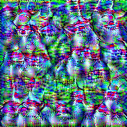
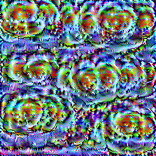

# Caltech-256-Activation-Maximization
Optimizing images to maximize activation of output neurons of a classification model trained for the Caltech 256 dataset.
 It is mainly lower-level features but still interesting.

In order to try it out download the latest release and make sure to set up the proper file paths.
  If you just want to view some of the results check out the [Image Results](Image-Results) folder (I know the images are out of order).
  My favorite images are #18 which is the bowling pins where you can clearly discern the red horizontal stripes.
  I also really like # 78 which are fried eggs as you can clearly see the yolk and whites.

